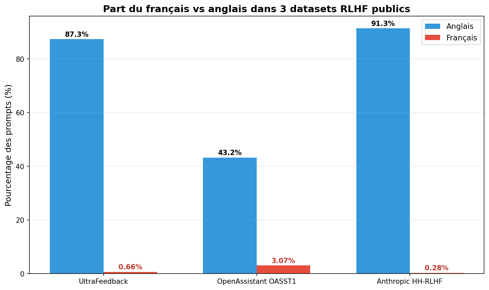
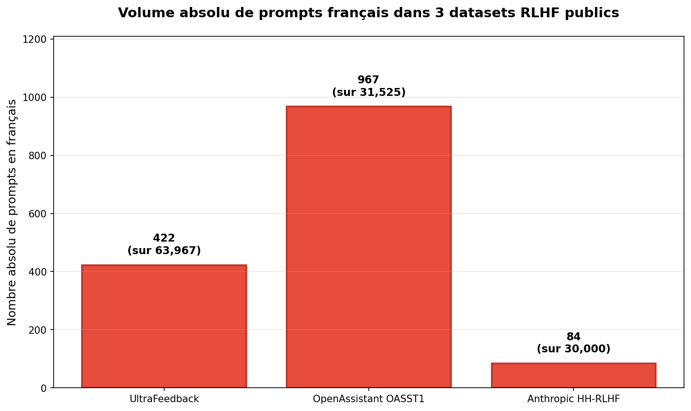
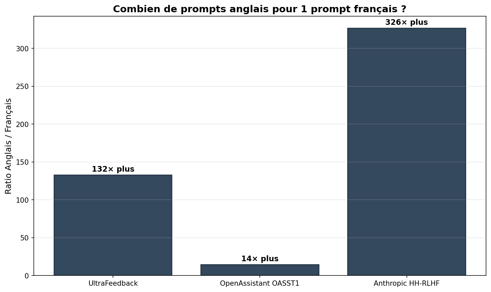

# Le français dans les datasets RLHF publics — un audit quantitatif

> **TL;DR** — Sur 125 492 prompts analysés à travers 3 datasets RLHF publics majeurs, le français représente **1.17%** (1 473 prompts) contre **77.21%** pour l'anglais. **Ratio anglais/français : 65 pour 1.**

---

## Pourquoi ce benchmark

Les modèles de langage modernes sont alignés via du **RLHF** (Reinforcement Learning from Human Feedback). La qualité de cet alignement dépend directement de la qualité et de la diversité linguistique des datasets de préférences utilisés.

Plusieurs déclarations publiques (notamment Arthur Mensch, CEO de Mistral) ont identifié la pénurie de données comme le principal goulot d'étranglement pour les LLM européens. Ce benchmark mesure concrètement, dataset par dataset, à quel point le français est sous-représenté dans les ressources publiques utilisées par la quasi-totalité de l'écosystème open-source.

L'objectif n'est pas de critiquer ces datasets — leurs auteurs ont fait un travail remarquable. L'objectif est de chiffrer un constat, pour qu'il puisse être discuté à partir de faits plutôt que d'intuitions.

---

## Résultats clés

### Pourcentage français vs anglais par dataset

### Volume absolu de prompts français

### Combien de prompts anglais pour 1 prompt français ?

---

## Tableau récapitulatif

| Dataset | Total prompts | %EN | %FR | Nb FR absolu | Ratio EN/FR |
|---|---:|---:|---:|---:|---:|
| **UltraFeedback** | 63 967 | 87.33% | 0.66% | 422 | 132× |
| **OpenAssistant OASST1** | 31 525 | 43.20% | 3.07% | 967 | 14× |
| **Anthropic HH-RLHF** | 30 000* | 91.35% | 0.28% | 84 | 326× |
| **Total** | **125 492** | **77.21%** | **1.17%** | **1 473** | **66×** |

*\*Échantillon aléatoire de 30 000 sur 160 800 dialogues (seed=42).*

Le détail brut : [`benchmark_french_rlhf_results.csv`](benchmark_french_rlhf_results.csv)

---

## Méthode

**Datasets analysés :**
- [`openbmb/UltraFeedback`](https://huggingface.co/datasets/openbmb/UltraFeedback) — un des datasets de feedback les plus utilisés pour DPO
- [`OpenAssistant/oasst1`](https://huggingface.co/datasets/OpenAssistant/oasst1) — projet communautaire multilingue de référence
- [`Anthropic/hh-rlhf`](https://huggingface.co/datasets/Anthropic/hh-rlhf) — dataset historique d'Anthropic, utilisé pour l'alignement helpfulness/harmlessness

**Détection de langue :** [lingua-py](https://github.com/pemistahl/lingua-py) en mode "low accuracy" (suffisant pour distinguer français/anglais avec une marge d'erreur < 2% sur OASST1 où la langue est aussi déclarée par les contributeurs — voir validation croisée dans le notebook).

**Périmètre :** seuls les **prompts utilisateur** sont analysés. Pour OASST1, filtrage sur `role == "prompter"`. Pour HH-RLHF, extraction du premier message humain via regex sur le champ `chosen`.

**Échantillonnage :** UltraFeedback et OASST1 sont analysés intégralement. HH-RLHF est échantillonné aléatoirement (30 000 / 160 800, seed=42) pour rester sous les 4h de calcul Colab. La marge d'erreur statistique sur les pourcentages est < 0.3% à ce volume d'échantillon.

---

## Limites

- **Détection automatique imparfaite** : sur des prompts très courts (< 10 caractères), la langue est marquée "trop_court" et exclue. Sur des prompts mêlant français et anglais, lingua attribue une langue dominante mais peut se tromper. Le bruit de détection (latin, tagalog, espéranto qui apparaissent à des taux suspects sur les textes courts ou techniques) est un effet connu.
- **Représentation ≠ qualité** : ce benchmark mesure des volumes, pas la qualité des prompts français présents. Une analyse qualitative est en préparation.
- **3 datasets ≠ tout l'écosystème** : Nectar, HelpSteer, Argilla DPO datasets, lmsys-chat-1m et d'autres sont à venir dans une v0.2.
- **Pas d'analyse des completions** : seuls les prompts sont analysés, pas les réponses associées.

---

## Reproduire

1. 1. Ouvrir [`staiph_french_rlhf_benchmark.ipynb`](staiph_french_rlhf_benchmark.ipynb) dans [Google Colab](https://colab.research.google.com/)
2. Créer un token Hugging Face (lecture seule) sur [huggingface.co/settings/tokens](https://huggingface.co/settings/tokens)
3. Coller le token dans la cellule `# Connexion à Hugging Face`
4. Accepter les conditions d'usage des 3 datasets sur Hugging Face si demandé
5. Run All — durée totale ~30-45 minutes selon la vitesse Colab

---

## Prochaines étapes

- [ ] Étendre à 4-5 datasets supplémentaires (Nectar, HelpSteer, lmsys-chat-1m, Argilla)
- [ ] Analyse qualitative des prompts français existants (longueur, complexité, registre)
- [ ] Comparaison avec d'autres langues européennes sous-représentées (italien, néerlandais, polonais)
- [ ] Audit des datasets de completions (pas seulement les prompts)

---

## Auteur

**Horeb N'DINGA** — co-fondateur de [STEF](https://steftalent.fr), infrastructure de données IA souveraine pour les acteurs européens du LLM.

STEF construit des datasets RLHF nativement français annotés par experts (juridique, finance, médical, code) sous une rubrique standardisée. Si ce benchmark vous parle et que vous travaillez sur un modèle qui mérite mieux que 0.66% de français : [horebndinga78@gmail.com](mailto:horebndinga78@gmail.com).

---

## Licence

MIT — utilisez, citez, étendez librement. Mentionner ce repo si vous le réutilisez.
